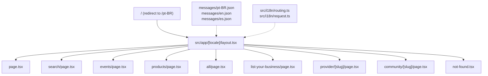

# i18n Implementation Plan (pt-BR / en / es)

## Constraint

The site uses `output: "export"` (static export), so there is no runtime server or middleware. All locale pages are pre-rendered at build time using `generateStaticParams`. `next-intl` supports this mode natively.

## Architecture



## 1. Install `next-intl`

```bash
npm install next-intl
```

## 2. Translation files

Create three JSON files under `messages/` at the project root:

- `messages/pt-BR.json` (default -- written first, others derived)
- `messages/en.json`
- `messages/es.json`

Structure (all UI strings grouped by namespace):

```json
{
  "nav": {
    "services": "Servicos",
    "events": "Eventos",
    "products": "Produtos",
    "listBusiness": "Anuncie Seu Negocio"
  },
  "home": {
    "title": "Servicos brasileiros na Australia",
    "subtitle": "Conecte-se com profissionais brasileiros ...",
    "allServices": "Todos os Servicos",
    "search": "Buscar",
    "featured": "Destaques",
    "browseAll": "Ver todos os provedores"
  },
  "search": { ... },
  "events": { ... },
  "products": { ... },
  "listBusiness": { ... },
  "provider": { ... },
  "community": { ... },
  "footer": { ... },
  "notFound": { ... },
  "common": {
    "instagram": "Instagram",
    "website": "Website",
    "moreInfo": "Mais informacoes"
  }
}
```

Approximately 50-60 keys total across all namespaces.

## 3. i18n configuration

### `[src/i18n/routing.ts](src/i18n/routing.ts)`

```typescript
import { defineRouting } from "next-intl/routing";

export const routing = defineRouting({
  locales: ["pt-BR", "en", "es"],
  defaultLocale: "pt-BR",
});
```

### `[src/i18n/request.ts](src/i18n/request.ts)`

```typescript
import { getRequestConfig } from "next-intl/server";
import { routing } from "./routing";

export default getRequestConfig(async ({ requestLocale }) => {
  let locale = await requestLocale;
  if (!locale || !routing.locales.includes(locale)) {
    locale = routing.defaultLocale;
  }
  return {
    locale,
    messages: (await import(`../../messages/${locale}.json`)).default,
  };
});
```

### Update `[next.config.ts](next.config.ts)`

Add the `next-intl` plugin:

```typescript
import createNextIntlPlugin from "next-intl/plugin";

const withNextIntl = createNextIntlPlugin("./src/i18n/request.ts");

export default withNextIntl(nextConfig);
```

## 4. Restructure routing

Move all pages from `src/app/` into `src/app/[locale]/`:

| Before                        | After                                                        |
| ----------------------------- | ------------------------------------------------------------ |
| `src/app/layout.tsx`          | Stays (minimal root layout)                                  |
| `src/app/page.tsx`            | `src/app/[locale]/page.tsx`                                  |
| `src/app/search/`             | `src/app/[locale]/search/`                                   |
| `src/app/events/`             | `src/app/[locale]/events/`                                   |
| `src/app/products/`           | `src/app/[locale]/products/`                                 |
| `src/app/all/`                | `src/app/[locale]/all/`                                      |
| `src/app/list-your-business/` | `src/app/[locale]/list-your-business/`                       |
| `src/app/provider/[slug]/`    | `src/app/[locale]/provider/[slug]/`                          |
| `src/app/community/[slug]/`   | `src/app/[locale]/community/[slug]/`                         |
| `src/app/not-found.tsx`       | `src/app/[locale]/not-found.tsx`                             |
| `src/app/sitemap.ts`          | `src/app/sitemap.ts` (stays, generates URLs for all locales) |

### Root layout (`src/app/layout.tsx`)

Becomes a minimal shell that just renders `{children}`. The `<html lang>`, fonts, `<Nav>`, `<Footer>` move into `src/app/[locale]/layout.tsx`.

### Locale layout (`src/app/[locale]/layout.tsx`)

- Reads `params.locale`
- Calls `setRequestLocale(locale)` for static rendering
- Sets `<html lang={locale}>` and metadata per locale
- Exports `generateStaticParams` returning all 3 locales
- Renders `NextIntlClientProvider` wrapping children
- Includes `<Nav>` and `<Footer>`

### Root redirect (`src/app/page.tsx`)

The root `/` page becomes a simple redirect to `/pt-BR`:

```typescript
import { redirect } from "next/navigation";
export default function RootPage() {
  redirect("/pt-BR");
}
```

## 5. Update all pages to use translations

Each server component page:

1. Receives `params.locale`
2. Calls `setRequestLocale(locale)`
3. Uses `getTranslations("namespace")` for server-side translations
4. Passes locale to metadata via `generateMetadata`

Each client component (search-client, events-client, products-client, filters):

1. Uses `useTranslations("namespace")` hook
2. Wrapped by `NextIntlClientProvider` from the locale layout

### Date formatting in `[src/components/event-card.tsx](src/components/event-card.tsx)`

Replace hardcoded `"en-AU"` with locale-aware formatting using `useFormatter()` from `next-intl`, or pass locale as a prop and use `toLocaleDateString(locale)`.

### Internal links

All `<Link href="/search">` become `<Link href={`/${locale}/search`}>`. Use `next-intl`'s `createNavigation` helper to get locale-aware `Link`, `redirect`, and `usePathname`:

```typescript
// src/i18n/navigation.ts
import { createNavigation } from "next-intl/navigation";
import { routing } from "./routing";

export const { Link, redirect, usePathname, useRouter } =
  createNavigation(routing);
```

Then replace all `import Link from "next/link"` with `import { Link } from "@/i18n/navigation"` -- links automatically prepend the current locale.

## 6. Flag dropdown (locale switcher)

Create `[src/components/locale-switcher.tsx](src/components/locale-switcher.tsx)` as a client component (`"use client"`).

- Reads current locale from `useLocale()` and current pathname from `usePathname()`
- Renders a dropdown button showing the current flag
- On selection, navigates to the same path in the new locale using `useRouter().replace()`
- Placed in `[src/components/nav.tsx](src/components/nav.tsx)` **before** the nav links

Flags and labels:

- `🇧🇷` pt-BR -- "Portugues"
- `🇺🇸` en -- "English"
- `🇪🇸` es -- "Espanol"

Dropdown implementation: a simple `<button>` toggle with an absolutely positioned `<div>` (no extra dependency needed), or use the existing `@base-ui/react` Menu component already in dependencies.

Position in nav:

```
[🇧🇷 v] | Services | Events | Products | [List Your Business]
```

## 7. Sitemap update

`[src/app/sitemap.ts](src/app/sitemap.ts)` must generate URLs for all locales. For each page, emit three entries (one per locale), with `alternates.languages` pointing to the other locale variants.

## 8. Metadata per locale

- `generateMetadata` in the locale layout reads the locale and returns translated `title`, `description`, `openGraph.locale`
- Page-level `generateMetadata` also receives locale and uses `getTranslations()` for page-specific meta

## Files changed (summary)

**New files (~8):**

- `messages/pt-BR.json`, `messages/en.json`, `messages/es.json`
- `src/i18n/routing.ts`, `src/i18n/request.ts`, `src/i18n/navigation.ts`
- `src/app/[locale]/layout.tsx`
- `src/components/locale-switcher.tsx`

**Moved files (~10):**

- All pages from `src/app/` to `src/app/[locale]/`

**Modified files (~12):**

- `next.config.ts` (add next-intl plugin)
- `src/app/layout.tsx` (minimal root shell)
- `src/app/page.tsx` (redirect to default locale)
- `src/components/nav.tsx` (use translated strings, add locale switcher)
- `src/components/footer.tsx` (use translated strings)
- `src/components/search-client.tsx`, `search-filters.tsx` (useTranslations)
- `src/components/events-client.tsx` (useTranslations)
- `src/components/products-client.tsx`, `product-community-filter.tsx` (useTranslations)
- `src/components/event-card.tsx` (locale-aware dates)
- `src/components/provider-card.tsx`, `product-card.tsx` (translated a11y labels)
- `src/app/sitemap.ts` (multi-locale URLs)
